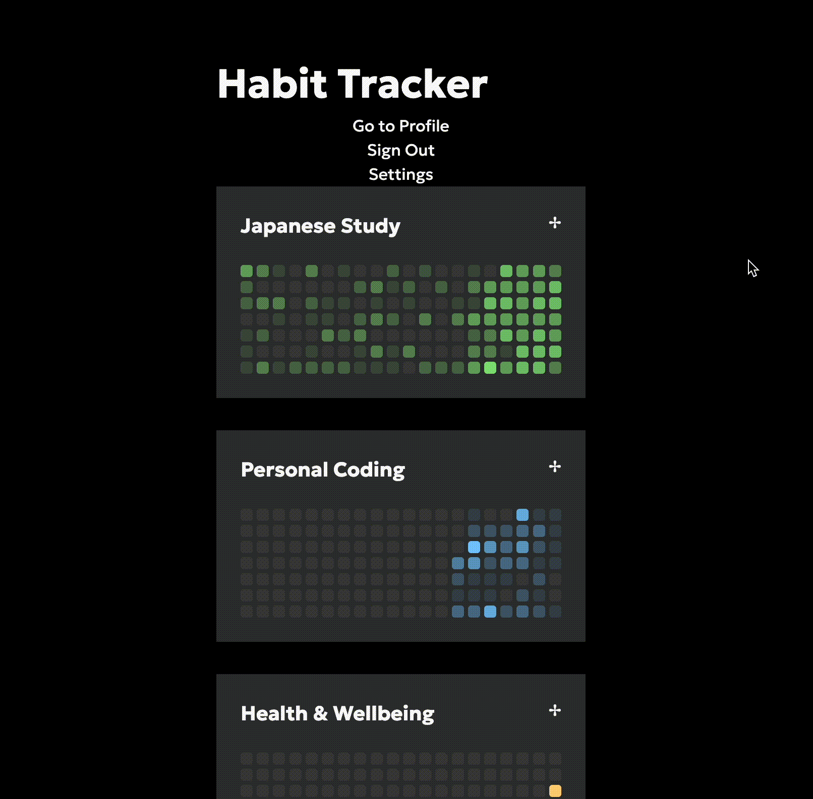

# Shuukan Habit Tracker

A visually pleasing and simple to use habit tracker. Supporting people to take the baby steps required to snowball into success.

## Demo

## Features

- Reactive grids on update
- Title habits i.e. "Fitness" and "Coding"
- Add specific tasks to each habit i.e. "Leetcode Question",
- Mobile-Friendly

## Acknowledgements

> The grid like structure of the trackers was heavily inspired by Github's contribution tables

## Tech Stack

Front-End: `React` + `TailwindCSS`\
Back-end: `Supabase`\
Hosted on: `Vercel`

## License

This project is free to use and licensed under the
[MIT license](https://choosealicense.com/licenses/mit/)
