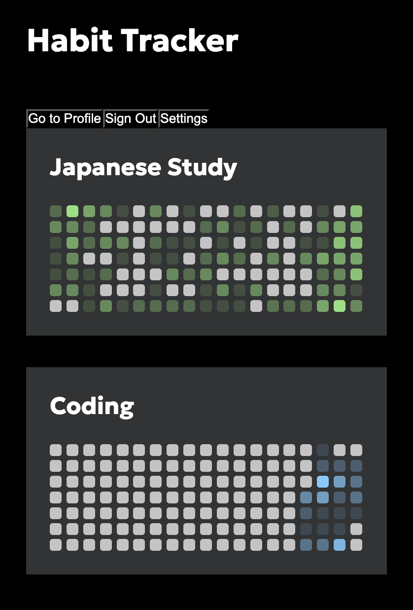
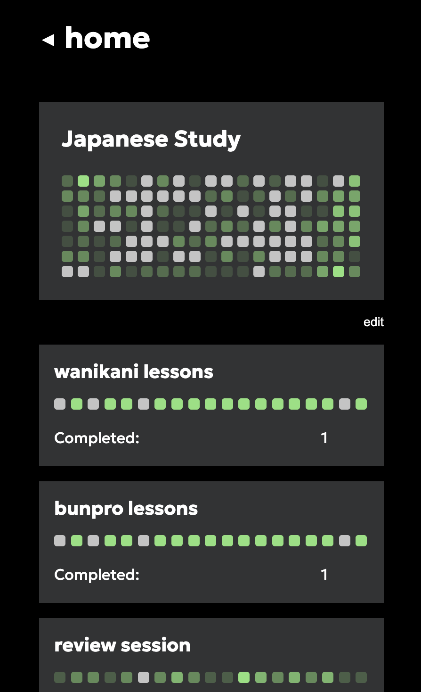

# 🧠 Habit Tracker

A minimalist and visually intuitive habit tracking app to help people build and maintain routines.
Track your progress, add specific materials to each habit, and visualize your consistency over time.

## ✨ Features

- 📊 **Visual habit grid**: View daily/weekly consistency using a Github contribution-style grid.
- 📁 **Category-based tracking**: Group habits under titles like “Fitness” or “Coding”.
- 🧩 **Custom materials**: Add specific tasks (e.g., Daily walk, Leetcode question) to each habit.
- 📈 **Progress breakdown**: See how many sub-tasks you've completed for each habit.
- 🕹️ **User-friendly interface**: Clean and dark-themed UI for focused usability.
- 🔒 **Authentication**: Profile management with sign-in and sign-out using SupaBase Auth.

## 📸 Screenshots

### Dashboard

### Expanded Habit View with Subtasks

---

## 🛠️ Tech Stack

The tech used in this project is: `React` on the front-end and hosted on `Vercel` with `Supabase` for authentication and database management.

---

## 🧩 Future Improvements

- 💡 Smoother UX
- 📈 Analytics and habit trends
- 🎯 Habit goals and streak challenges

---

## 📄 License

This project free to use, and is licensed under the [MIT License](./LICENSE). The UI was inspired by Github's contribution graphs.
